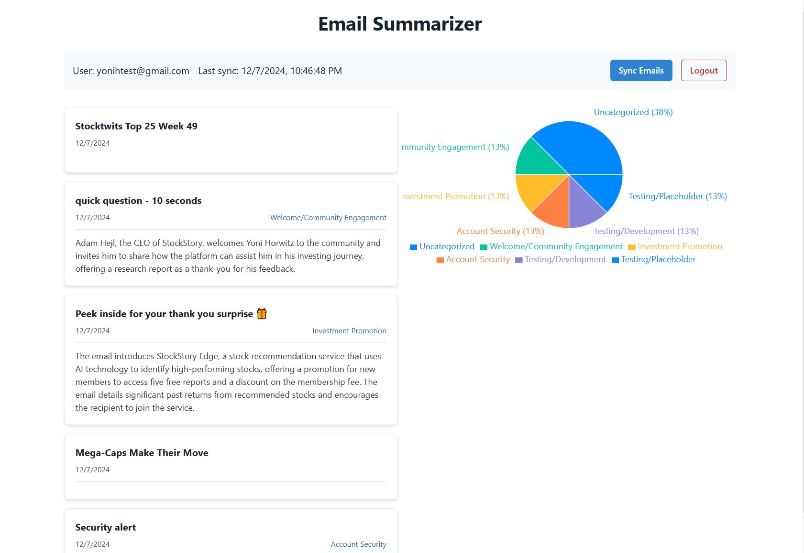

# E-mail Summarizer

# Project Setup

## Prerequisites
- Docker
- Docker Compose
- Node.js

- Nylas account
- OpenAI account

## Setup Instructions

1. Clone the repository
- git clone https://github.com/yonihorwitz/EmailSummarizer.git
- cd EmailSummarizer

2. Set up environment variables according to .env.example

3. Start the stack
- docker compose up --build

## Using the App

1. Open http://localhost:3000 on the browser
2. Log in to a Nylas account
3. Hit the "Sync Emails" button

## Project Discussion

The EmailSummarizer app is comprised of the following components:
- Frontend
- Web-server
- Sync Service
- Processor Service
- Database

The Sync and Processor services were split off from the web-server so that the server wouldn't have any long-running requests. Instead, the web-server sends sync requests via RabbitMQ when sync is requested by the user.  

The Processor service is also kept separate.  This is done for the purposes of scaling, and so that e-mails are loaded onto the database quickly.  In case of heavy processing loads, the user would still be able to view their e-mails until processing completes for their e-mails, but the Category fields would be blank.

# Database

For the purposes of this project, the database is loaded by the web-server initialization script.

The database contains two tables:  Emails and Users.  The Users table saves the Nylas ID per user, which allows the daily sync to reach out to each user's mailbox.

# Authentication

The project uses Nylas' endpoint for authentication, and maintains user sessions on the web-server, including login/logout functionality.

# E-mail Categorization

OpenAI's completion engine was used to e-mail summarization and categorization.  Future work on this application would involve tweaking the completion prompt to obtain better categorization results.

## TODO:

- Typescript
- Better DB migration management, or ORM
- Generic API wrapper for e-mail sync
- Tests
- Async message back to FE on sync completion (currently using 5 second timeout)
- Email list pagination
